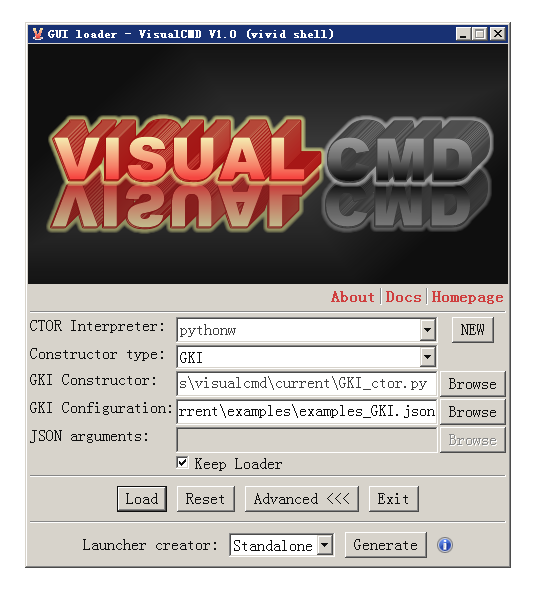
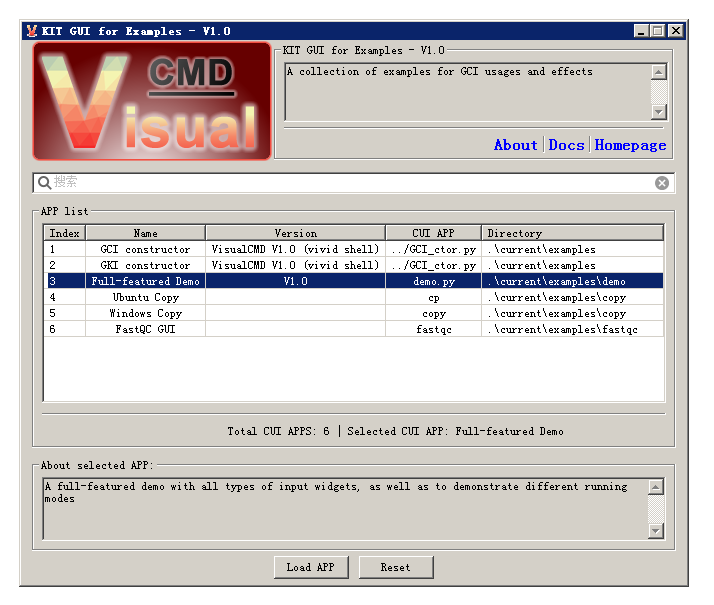
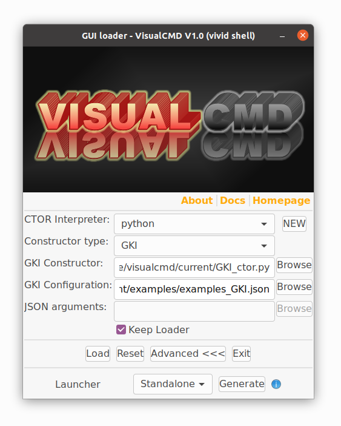
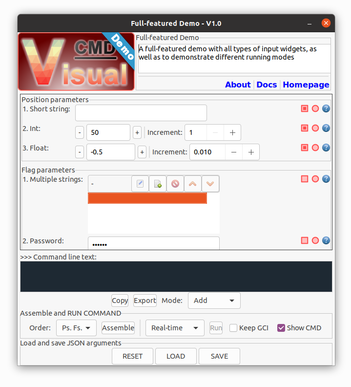

  
VisualCMD: a python implementation of the graphical command-line interface
===============================================================================================================

* * *

*   ### What does VisualCMD do?
    
    VisualCMD provides a solution to automatically generate a GUI for:  
    **(1).** a collection of multiple CUI applications;  
    **(2).** a CUI application (with arguments);  
    **(3).** a system-level CMD (with arguments);  
    WITHOUT any change of the existing applications;  
    ONLY requires a JSON-based configuration file.
*   ### Highlighted features
    
    Core GUI constructors are designed as single-files (with default images embedded), and can be used as standalone tools;  
    Defines and supports multiple input widgets (including basic string, int, float, range, file, folder and colour);  
    Auto formating and validating inputs (such as date, time, url and string length);  
    More input types and validations can be customized via regular-expression patterns;  
    Supports customized splash, icon, logo and waiting images;  
    Supports argument with multiple values;  
    Supports exclusive arguments;  
    Running of CMDs via multiple modes: realtime (displaying output), background (displaying waiting image) and unattended (non-interactive);  
    CMD and arguments can be saved and loaded;  
    Supports multiple operating systems;  
    
*   ### Installation
    
    **(1) . Required environments:**
    
    Python 3.x, with pip
    
    (2). Install wxPython for GUI supports
    
    Recommended version: 4.x  
    For Windows:
    
    \>>> pip install -U wxPython
    
    For Ubuntu 20.04:
    
    \>>> pip install -U -f https://extras.wxpython.org/wxPython4/extras/linux/gtk3/ubuntu-20.04 wxPython
    
    #for libsdl supports, if needed
    
    \>>> sudo apt-get install libsdl2-2.0  
    \>>> sudo apt-get install libsdl2-dev
    
    \*For other Linux distributions, please find the correct versions from: [https://extras.wxpython.org/wxPython4/extras/linux/](https://extras.wxpython.org/wxPython4/extras/linux/)
    
    See: [https://www.wxpython.org/pages/downloads/](https://www.wxpython.org/pages/downloads/)
    
*   ### Development and testing environments
    
    (1). VisualCMD was developed and tested under Windows OS:
    
    Windows 7 Ultimate, 64bit; Python 3.8.10; wxPython 4.1.1
    
    \*Note: there may be "unsupported locale setting" issue under Windows due to the compatibility of wxPython. However, this issue does not affect the overall functionalities.
    
    GUI snapshot for Windows:
    
    The main entrance (GUI\_loader):  
    
    
    Demo KIT-GUI for the examples:  
    
    
    Demo APP-GUI for the full-featured demo:  
    
    
    (2). SeqWIz was aslo tested under Ubuntu OS:
    
    ubuntu-20.04.2.0-desktop-amd64; Python 3.8.10; wxPython 4.1.1
    
    \*Note: there may be "Gtk-WARNING" issue under Ubuntu due to the compatibility of wxPython. However, this issue does not affect the overall functionalities.
    
    GUI snapshot for Ubuntu:
    
    The main entrance (GUI\_loader):  
    
    
    Demo KIT-GUI for the examples:  
    
    
    Demo APP-GUI for the full-featured demo:  
    
    
*   ### Usage
    
    (1). Prepare customized images (splash, icon, logo, wait), if needed;  
    (2). Create a configuration file (JSON based) for the GUI;  
    \*There are two types configuration, as shown in the examples: \*\_GKI.json for a KIT, and \*\_GCI.json for a CUI-APP or system CMD.  
    (3). Use the GUI\_loader to directly launch the GUI shell or create a standalone / shortcut launcher;  
    (4). The image files, JSON configuration file and the standalone launcher can also be distributed in your project as a GUI supporting;
*   ### Current version
    
    VisualCMD V1.0  
    Code name: vivid shell
*   ### License
    
    This project follows the GNU General Public License (version: 3.0).
    
    See: [https://www.gnu.org/licenses/gpl-3.0.en.html](https://www.gnu.org/licenses/gpl-3.0.en.html)